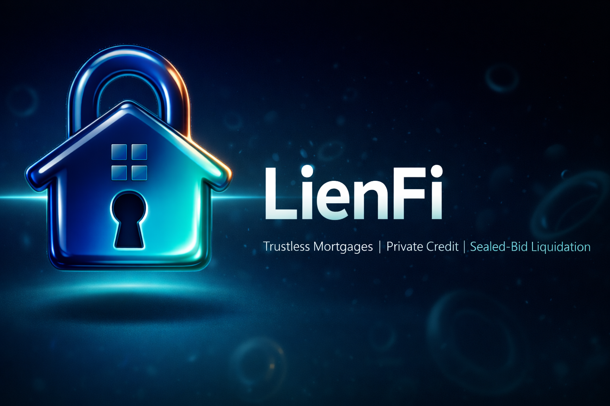

<p align="center">
  
</p>

<h1 align="center">LienFi</h1>
<p align="center"><i>Trustless Mortgages with Private Credit Scoring & Sealed-Bid Liquidation</i></p>

<p align="center">
  A complete on-chain mortgage system where credit data is assessed privately inside a confidential enclave (never touches the chain), property collateral is locked as privacy-preserving NFTs, lenders earn passive yield, and loan defaults trigger sealed-bid Vickrey auctions where bid amounts, bidder identities, and losing bids are never exposed on-chain.
</p>

<p align="center">
  <a href="#"></a>
  <a href="#"></a>
  <a href="#"></a>
  <a href="#"></a>
  <a href="#"></a>
</p>

<p align="center">
  <a href="#-the-problem">Problem</a> &bull;
  <a href="#-how-lienfi-works">How It Works</a> &bull;
  <a href="#-system-flow">System Flow</a> &bull;
  <a href="#-privacy-guarantees">Privacy</a> &bull;
  <a href="#-smart-contracts">Contracts</a> &bull;
  <a href="#-chainlink-services-used">Chainlink</a> &bull;
  <a href="#-tech-stack">Tech Stack</a> &bull;
  <a href="#-quick-start">Quick Start</a>
</p>

---

## The Problem

DeFi lending today requires **overcollateralization** because protocols have no way to assess real-world creditworthiness without exposing private financial data on-chain. Traditional on-chain auctions are fully transparent — bid amounts, bidder identities, and losing bids are permanently visible. Together these two gaps make a trustless mortgage impossible.

**No existing protocol solves both simultaneously:**

| Gap | Why It Matters |
|-----|---------------|
| **No private credit scoring** | Borrowers must reveal income, bank history, and debt ratios publicly — or protocols skip underwriting entirely and demand 150%+ collateral |
| **Transparent liquidation auctions** | Bid amounts are public (competitors snipe), bidder identities are exposed (privacy leak), losing bidders are visible (reputational risk) |
| **No property data privacy** | Tokenized real estate exposes street addresses, appraisal values, and owner identities on-chain forever |
| **Sybil-vulnerable auctions** | A single entity can create hundreds of wallets to manipulate liquidation outcomes |

For tokenized real estate worth hundreds of thousands, these aren't inconveniences — they're dealbreakers.

---

## How LienFi Works

LienFi is a complete mortgage primitive with no step requiring a bank, appraiser, or court:

> *Lenders fund a USDC pool. Borrowers prove creditworthiness privately. Property NFT locked as collateral. Monthly EMI repayments grow pool yield. Default triggers sealed-bid auction to recover funds.*

### The Lifecycle

| Phase | What Happens | Privacy |
|-------|-------------|---------|
| **A. Pool Funding** | Lenders deposit USDC, receive clUSDC receipt tokens. Exchange rate rises as EMIs accumulate — passive yield, no staking. | clUSDC balances public |
| **B. Property NFT** | Borrower verifies property via CRE enclave. Only a `commitmentHash` goes on-chain — no address, no value, no metadata. | Full details enclave-only |
| **C. Credit Assessment** | Borrower submits loan request hash on-chain. CRE auto-triggers: Plaid data fetch, metric extraction, hard rule gates, Gemini AI scoring. Raw data discarded after. | Financial data never on-chain |
| **D. Loan Disbursement** | Approved borrower locks PropertyNFT as collateral. USDC disbursed from pool. Loan record created on-chain. | Approval visible, financials hidden |
| **E. Monthly Repayment** | Borrower pays fixed EMI. Full amount enters pool, raising clUSDC exchange rate. On full repayment, NFT returned. | EMI schedule public |
| **F. Default + Auction** | 3 missed payments trigger default. PropertyNFT transferred to LienFiAuction. Sanitized listing (no address, no "default" label). Sealed bids via CRE. Vickrey settlement. Winner gets NFT + full address reveal. | Bids, bidders, losing bids all hidden |

### Key Features

- **Private Credit Scoring** — Plaid bank data fetched inside CRE enclave, pre-processed into metrics, scored by Gemini AI. Raw financial data is discarded after assessment — never persisted, never on-chain.
- **Privacy-Preserving Property NFTs** — ERC-721 with only a commitment hash on-chain. No tokenURI, no metadata. Full details stored exclusively in the CRE enclave.
- **Passive Yield for Lenders** — clUSDC exchange rate model (same as Compound cTokens). Pool USDC grows as EMIs come in, each clUSDC redeems for more. No staking, no claiming.
- **Sealed-Bid Vickrey Auctions** — Bid amounts exist only inside the CRE enclave. On-chain: only opaque bid hashes. Winner pays second-highest price. Losing bids and bidders are never revealed.
- **World ID Sybil Resistance** — On-chain ZK proof verification. One human, one deposit. No fake accounts manipulating auctions.
- **Event-Driven Assessment Pipeline** — `LoanRequestSubmitted` event auto-triggers the entire credit assessment. No manual CRE trigger, no separate oracle — one coherent system.
- **Sanitized Listings** — Default auctions show property type, neighborhood, size — but never the street address, owner identity, or reason for sale. Winner gets full details post-settlement only.

---

## System Flow

```
                                    LIENFI

 PHASE A: POOL FUNDING
 ──────────────────────────────────────────────────────────────────
  Lender
    |  deposit(USDC)
    v
  LendingPool ──── mint clUSDC ──> Lender
    |
    |  exchangeRate = poolUSDC / clUSDC.totalSupply()
    |  (rate rises as EMIs accumulate -> lenders earn yield passively)


 PHASE B: PROPERTY NFT MINTING
 ──────────────────────────────────────────────────────────────────
  Borrower --> POST /verify-property (propertyId, docs)
                    |
                    v
              API (enclave)
                    |  stores full details internally (never on-chain)
                    |  computes commitmentHash = keccak256(addr+value+docs+secret)
                    |  returns { tokenId, commitmentHash }
                    |
  Borrower --> LoanManager.mintPropertyNFT(commitmentHash)
                    |
                    v
              PropertyNFT ──── tokenId + commitmentHash stored on-chain
                               (no metadata, no address, no value visible)


 PHASE C: LOAN REQUEST + CREDIT ASSESSMENT (EVENT-DRIVEN)
 ──────────────────────────────────────────────────────────────────
  Borrower
    |
    |-(1)-> POST /loanRequest { plaidToken, tokenId, amount, tenure }
    |              |
    |              v
    |         API stores details, returns requestHash
    |
    |-(2)-> LoanManager.submitRequest(requestHash)
    |              |
    |              |  emits LoanRequestSubmitted(borrower, requestHash)
    |              |
    |              v
    |      +------------------------------------------------------------+
    |      |        CRE ENCLAVE (auto-triggered by event)               |
    |      |                                                            |
    |      |  1. Fetch details from API DB using requestHash            |
    |      |  2. Recompute + verify hash (abort if mismatch)            |
    |      |  3. Get appraisedValue from enclave store (tokenId)        |
    |      |  4. Compute EMI = P*r*(1+r)^n / ((1+r)^n - 1)             |
    |      |  5. Fetch Plaid data via Confidential HTTP                 |
    |      |  6. Pre-process: income, DTI, stability, overdraft rate    |
    |      |  7. Hard gates: LTV<=80%, coverage>=3x, no recent defaults |
    |      |  8. Pass metrics (NOT raw data) to Gemini                  |
    |      |  9. Gemini returns: creditScore, verdict, approvedAmount   |
    |      |  10. Discard all raw financial data                        |
    |      |  11. Write verdict via KeystoneForwarder                   |
    |      +------------------------------------------------------------+
    |              |
    |              v
    |      LoanManager._writeVerdict()
    |              |-- APPROVED -> store pendingApprovals[borrower]
    |              |-- REJECTED -> emit LoanRequestRejected


 PHASE D: LOAN DISBURSEMENT
 ──────────────────────────────────────────────────────────────────
  Borrower --> LoanManager.borrow(tokenId, amount, tenure)
                    |
                    |  check pendingApprovals[borrower] exists + not expired
                    |  verify amount <= approvedLimit
                    |  check LendingPool.availableLiquidity() >= amount
                    |
                    |-> PropertyNFT.transferFrom(borrower -> LoanManager)
                    |   (collateral locked)
                    |
                    |-> LendingPool.disburse(borrower, amount)
                    |        |
                    |        --> USDC transferred to borrower wallet
                    |
                    --> Loan record created on-chain
                              { loanId, emiAmount, nextDueDate, status:ACTIVE }


 PHASE E: MONTHLY REPAYMENT
 ──────────────────────────────────────────────────────────────────
  Borrower --> LoanManager.repay(loanId)  [every 30 days]
                    |
                    |  accept exactly emiAmount USDC
                    |  reduce remainingPrincipal
                    |
                    --> LendingPool.repayEMI(emiAmount)
                              |
                              --> pool USDC balance grows
                                        |
                                        --> clUSDC exchange rate rises
                                                  |
                                                  --> lenders earn yield passively

  On full repayment:
    PropertyNFT returned to borrower --> Loan closed


 PHASE F: DEFAULT + SEALED-BID LIQUIDATION
 ──────────────────────────────────────────────────────────────────
  Anyone --> LoanManager.checkDefault(loanId)  [keeper/cron]
                    |
                    |  miss 1 -> emit PaymentMissed (warning)
                    |  miss 2 -> emit PaymentMissed (grace period)
                    |  miss 3 -> _triggerDefault()
                    |                |
                    |                v
                    |       loan.status = DEFAULTED
                    |       PropertyNFT -> LienFiAuction
                    |       LienFiAuction.initiateDefaultAuction(
                    |           tokenId, reservePrice=remainingPrincipal)
                    |
                    v
      +------------------------------------------------------------+
      |  CRE ENCLAVE (listing generation)                          |
      |                                                            |
      |  Retrieve full property details (tokenId -> enclave store) |
      |  Generate sanitized listing:                               |
      |    + property type, size, year built                       |
      |    + city + neighborhood (NOT street address)              |
      |    + verified appraisal value + reserve price              |
      |    - no street address, no owner identity, no "default"    |
      |  Compute listingHash, store on-chain in Auction struct     |
      +------------------------------------------------------------+
                    |
                    v
  Bidders view sanitized listing
                    |
  Bidder --> depositToPool(USDC, lockUntil) + World ID ZK proof
  Bidder --> POST /bid { auctionId, amount, signature } via CRE
                    |
                    v  (Confidential HTTP -- bid stays private)
      +------------------------------------------------------------+
      |  CRE Bid Workflow                                          |
      |    validate EIP-712 signature                              |
      |    check pool balance >= bid amount                        |
      |    store bid encrypted in enclave                          |
      |    return opaque bidHash                                   |
      +------------------------------------------------------------+
                    |
                    --> LienFiAuction: only bidHash stored on-chain
                          (bid amount invisible to all observers)

  [auction deadline passes]
                    |
      +------------------------------------------------------------+
      |  CRE Settlement Workflow (cron-triggered)                  |
      |    retrieve all bids from enclave                          |
      |    Vickrey: winner = highest bid                           |
      |             price  = second-highest bid (or reserve)       |
      |    all losing bids discarded -- never revealed             |
      +------------------------------------------------------------+
                    |
                    v
      LienFiAuction._settleAuction(winner, price)
                    |
                    |-> PropertyNFT transferred to winner
                    |
                    --> LoanManager.onAuctionSettled(loanId, proceeds)
                              |
                              |-- proceeds >= debt -> full repayment to pool
                              |                       surplus -> borrower
                              |-- proceeds < debt  -> partial repayment to pool
                                                      shortfall absorbed by pool

  Winner --> POST /reveal/:auctionId (signed request)
                    |
                    --> CRE returns full street address + ownership docs
                          (Confidential HTTP -- winner only, post-settlement)


 PRIVACY BOUNDARY SUMMARY
 ──────────────────────────────────────────────────────────────────
  PRIVATE (CRE enclave only)          ON-CHAIN (public)
  ----------------------------        --------------------------------
  Plaid financial data                Credit verdict (approve/reject + limit)
  Credit score + Gemini reasoning     requestHash (meaningless without preimage)
  Property address + documents        commitmentHash (unreadable fingerprint)
  Appraisal details                   Loan record (no financial details)
  Bid amounts + bidder identities     EMI schedule + payment history
  Vickrey settlement logic            Opaque bid hashes only
  Full listing details (pre-reveal)   Winner + settlement price
                                      clUSDC balances + exchange rate
```

---

## System Participants

| Actor | Role |
|-------|------|
| **Lender / Investor** | Deposits USDC into lending pool, earns yield via clUSDC exchange rate appreciation |
| **Borrower** | Verifies property, applies for loan, locks PropertyNFT as collateral, repays monthly EMIs |
| **CRE Enclave** | Confidential compute — credit assessment (Plaid + Gemini), property data custodian, auction listing generator, bid/settlement engine |
| **LoanManager** | Core contract — owns the full mortgage lifecycle from origination through repayment to liquidation |
| **LendingPool** | Holds USDC, disburses loans, receives EMI repayments, manages clUSDC exchange rate |
| **PropertyNFT** | ERC-721 — one token per property, commitment hash only, no metadata on-chain |
| **LienFiAuction** | Sealed-bid Vickrey auction for defaulted properties — deposit pool, World ID, opaque bid hashes |

---

## Privacy Guarantees

| Information | On-Chain Visibility | Who Sees It |
|-------------|-------------------|-------------|
| Borrower financials (income, bank data) | **Never** | Nobody — discarded after assessment |
| Credit score / Gemini reasoning | **Never** | Nobody — discarded after assessment |
| Loan request details | requestHash only | Nobody (hash is meaningless without pre-image) |
| Property address + ownership docs | **Never** | Winner only — post-settlement via CRE |
| Property appraisal value | Via sanitized listing | Public (neighborhood-level only during auction) |
| Bid amounts | **Never** | Nobody — only hashes on-chain |
| Losing bidder identities | **Never** | Nobody |
| Reason for auction | **Never** | Nobody — no "default" or "foreclosure" label |
| Approval verdict | Approve / reject + limit | On-chain (public) |
| EMI schedule + payment history | On-chain | Public |
| clUSDC balances + exchange rate | On-chain | Public |

**Additional privacy layers:**
- Multi-token obfuscation — USDC deposits carry no auction reference, observers can't link deposits to specific auctions
- API credentials decrypted only inside CRE enclave — never exposed to any party
- Settlement responses AES-GCM encrypted before leaving enclave
- World ID ZK proofs — identity verified without revealing who you are
- PropertyNFT has no `tokenURI` — zero on-chain metadata leakage

---

## Smart Contracts

### Existing (Auction Engine — Deployed on Sepolia)

| Contract | Purpose |
|----------|---------|
| **LienFiAuction.sol** | Core auction + deposit pool + World ID sybil resistance + opaque bid hash storage + Vickrey settlement via CRE |
| **LienFiRWAToken.sol** | ERC-20 RWA token with restricted minting (to be replaced by PropertyNFT) |
| **MockWorldIDRouter.sol** | Always-passing World ID mock for testing |
| **MockUSDC.sol** | Test USDC token (6 decimals) with public mint |
| **ReceiverTemplate.sol** | Abstract base for receiving Keystone CRE DON-signed reports |

### New (Lending System — In Development)

| Contract | Purpose |
|----------|---------|
| **LoanManager.sol** | Full mortgage lifecycle — request anchoring, CRE verdict receiver, loan origination, repayment tracking, default triggering, auction settlement callback |
| **LendingPool.sol** | USDC pool — lender deposits, loan disbursement, EMI collection. Access-controlled by LoanManager |
| **clUSDC.sol** | ERC-20 receipt token. Minted on deposit, burned on withdrawal. Exchange rate appreciates as pool USDC grows |
| **PropertyNFT.sol** | ERC-721 — one token per property, stores only `commitmentHash`. No tokenURI, no on-chain metadata |

### Architecture Decisions

| Decision | Rationale |
|----------|-----------|
| ERC-721 (not ERC-20) for property | One token per property, no fractions needed |
| No metadata on-chain | Property details in CRE enclave only — commitment hash as tamper-proof anchor |
| clUSDC exchange rate model | No per-lender yield tracking needed — pool USDC grows as EMIs come in, rate rises automatically (same as Compound cTokens) |
| LoanManager owns all loan state | No separate oracle contract — approval verdict and loan lifecycle in one contract |
| requestHash as DB key + on-chain anchor | Single value proves request integrity; DB lookup key off-chain, tamper check on-chain |
| Event-driven CRE trigger | `LoanRequestSubmitted` event auto-triggers assessment — one coherent system, no manual step |
| EMI computed in enclave | Used for income coverage gate check; stored in approval; read at disbursement — no recomputation |

---

## Chainlink Services Used

| Service | Usage | Where |
|---------|-------|-------|
| **CRE Workflow Engine** | 5 workflows orchestrating the entire system — mint, bid, settle, credit assessment, listing generation | All phases |
| **Confidential HTTP** | Plaid API calls (bank data), Gemini API calls (AI scoring), bid submission, settlement — all inside enclave | Credit assessment, auction |
| **Vault DON Secrets** | API keys (Plaid, Gemini, bid API) and AES encryption keys stored securely, decrypted only in enclave | All workflows |
| **Encrypted Output** | AES-GCM encryption of settlement results and credit verdicts before leaving enclave | Settlement, credit |
| **Log-Based Trigger** | `LoanRequestSubmitted` event auto-triggers credit assessment workflow — no HTTP trigger needed | Credit assessment |
| **Cron Trigger** | Settlement workflow runs every 30 seconds, checking for expired auctions to settle | Auction settlement |
| **EVM Read/Write** | On-chain state reads (auction status, pool balances) and DON-signed report submission via KeystoneForwarder | All workflows |

---

## Tech Stack

| Layer | Technology | Purpose |
|-------|-----------|---------|
| **Smart Contracts** | Solidity 0.8.24 + Foundry | LoanManager, LendingPool, LienFiAuction, PropertyNFT, clUSDC |
| **Contract Libraries** | OpenZeppelin | ERC-20, ERC-721, Ownable, ReentrancyGuard |
| **Identity** | World ID (Worldcoin) | On-chain ZK proof verification, sybil resistance |
| **Confidential Compute** | Chainlink CRE | 5 workflows — mint, bid, settle, credit assessment, listing |
| **Credit Data** | Plaid API (Sandbox) | Bank account data, transaction history, income verification |
| **AI Scoring** | Google Gemini | Credit scoring from pre-processed financial metrics |
| **Network** | Ethereum Sepolia | Testnet deployment |
| **Private API** | Express.js + TypeScript | Bid storage, EIP-712 verification, Vickrey logic, loan request storage, property data custodian |
| **Signature Standard** | EIP-712 | Typed structured data for bid signing and identity verification |
| **Encryption** | AES-GCM | Settlement and credit verdict encryption in enclave |

---

## Quick Start

### Prerequisites

- [Foundry](https://book.getfoundry.sh/getting-started/installation) (`foundryup`)
- [CRE CLI](https://docs.chain.link/cre/getting-started/cli-installation)
- Node.js 20+
- Sepolia ETH for gas

### Installation

```bash
# Clone the repository
git clone https://github.com/yourusername/lienfi.git
cd lienfi

# --- Smart Contracts ---
cd contracts
forge install
cp .env.example .env
# Edit .env: add PRIVATE_KEY, SEPOLIA_RPC_URL, WORLD_ID_APP_ID

source .env
forge script script/DeployLienFi.s.sol:DeployLienFi \
  --rpc-url "$SEPOLIA_RPC_URL" --broadcast

# Note the deployed addresses from the output

# --- Private API ---
cd ../api
npm install
cp .env.example .env
# Edit .env: add BID_API_KEY, VERIFYING_CONTRACT, RPC_URL

npm run dev
# API running at http://localhost:3001

# --- CRE Workflows ---
cd ../cre-workflows/bid-workflow
bun install

# Simulate bid workflow
cd ..
cre workflow simulate ./bid-workflow \
  --target staging-settings \
  --http-payload @bid-payload.json \
  --non-interactive --trigger-index 0
```

### Environment Variables

```env
# --- Deployer ---
PRIVATE_KEY=0x...
SEPOLIA_RPC_URL=https://eth-sepolia.g.alchemy.com/v2/YOUR_KEY

# --- World ID ---
WORLD_ID_APP_ID=app_staging_...

# --- API Secrets ---
BID_API_KEY=...          # openssl rand -hex 32
HMAC_KEY=...

# --- Credit Assessment (new) ---
PLAID_CLIENT_ID=...
PLAID_SECRET=...
PLAID_ENV=sandbox
GEMINI_API_KEY=...
INTEREST_RATE_BPS=800    # 8% annual

# --- Deployed Contracts (populated after deployment) ---
LIENFI_AUCTION=0x...
LENDING_POOL=0x...
LOAN_MANAGER=0x...
PROPERTY_NFT=0x...
MOCK_USDC=0x...
CL_USDC=0x...
```

---

## End-to-End Flow

```
 1.  Lender deposits USDC          -> receives clUSDC at current exchange rate
 2.  Borrower verifies property     -> CRE computes commitmentHash, stores details in enclave
 3.  Borrower mints PropertyNFT    -> tokenId + commitmentHash on-chain, no metadata
 4.  Borrower POSTs loan details   -> stored in DB keyed by requestHash, receives requestHash
 5.  Borrower calls submitRequest  -> requestHash anchored on-chain, LoanRequestSubmitted emitted
 6.  CRE auto-triggered by event   -> fetches DB, verifies hash, Plaid -> Gemini -> verdict on-chain
 7.  Borrower calls borrow()       -> approval checked, NFT locked, USDC disbursed from pool
 8.  Borrower repays monthly       -> full EMI enters pool, clUSDC exchange rate rises
 9.  3 missed payments             -> checkDefault() called, NFT to auction, default triggered
10.  Sanitized listing published   -> neighborhood-level details + listingHash on-chain
11.  Bidders participate           -> USDC deposited, signed bids via CRE, hashes on-chain only
12.  Auction settles               -> Vickrey in enclave, winner + price on-chain, pool repaid
13.  Winner requests reveal        -> signed request, CRE returns full address via Confidential HTTP
```

---

## What's Already Built

The sealed-bid auction engine is fully implemented and tested on Sepolia:

| Component | Status |
|-----------|--------|
| `LienFiAuction.sol` — deposit pool, World ID, opaque bid hashes, Vickrey settlement | Deployed |
| `LienFiRWAToken.sol` — ERC-20 RWA token (will be replaced by ERC-721 PropertyNFT) | Deployed |
| CRE bid-workflow — HTTP-triggered sealed bid collection via Confidential HTTP | Deployed |
| CRE settlement-workflow — cron-triggered Vickrey settlement | Deployed |
| CRE mint-workflow — HTTP-triggered RWA token minting | Deployed |
| Private API — `/bid`, `/settle`, `/status` with EIP-712 + Vickrey logic | Deployed (Render) |

**Everything lending-related is new.** The ERC-20 property token becomes an ERC-721.

---

## Project Structure

```
lienfi/
├── contracts/                           # Solidity smart contracts (Foundry)
│   ├── src/
│   │   ├── LienFiAuction.sol           # Auction: pool + World ID + sealed bids + Vickrey
│   │   ├── LienFiRWAToken.sol          # ERC-20 RWA token (being replaced by PropertyNFT)
│   │   ├── LoanManager.sol              # [NEW] Full mortgage lifecycle + CRE verdict receiver
│   │   ├── LendingPool.sol              # [NEW] USDC pool, disburse, EMI collection
│   │   ├── clUSDC.sol                   # [NEW] Receipt token, appreciating exchange rate
│   │   ├── PropertyNFT.sol              # [NEW] ERC-721, commitment hash only, no metadata
│   │   ├── ReceiverTemplate.sol         # Abstract base for Keystone CRE reports
│   │   ├── interfaces/
│   │   │   ├── IWorldID.sol
│   │   │   └── ILienFiRWAToken.sol
│   │   ├── libraries/
│   │   │   └── ByteHasher.sol           # World ID field hashing
│   │   └── mocks/
│   │       ├── MockWorldIDRouter.sol     # Always-pass World ID for testing
│   │       └── MockUSDC.sol             # 6-decimal test USDC
│   ├── script/
│   │   └── DeployLienFi.s.sol          # Full deployment + wiring script
│   └── foundry.toml
├── api/                                 # Private API (Express.js + TypeScript)
│   ├── src/
│   │   ├── server.ts
│   │   ├── routes/
│   │   │   ├── bid.ts                   # POST /bid — EIP-712 validation + bid storage
│   │   │   ├── settle.ts               # POST /settle — Vickrey settlement
│   │   │   ├── status.ts               # GET /status/:auctionId
│   │   │   ├── loanRequest.ts          # [NEW] POST /loanRequest — store details, return hash
│   │   │   ├── listing.ts             # [NEW] GET /listing/:auctionId — sanitized listing
│   │   │   └── reveal.ts              # [NEW] POST /reveal/:auctionId — winner-only full details
│   │   └── lib/
│   │       ├── store.ts                 # In-memory bid + loan request + property storage
│   │       ├── eip712.ts               # EIP-712 signature verification
│   │       ├── auth.ts                 # API key middleware
│   │       ├── chain.ts               # On-chain state reads
│   │       └── vickrey.ts             # Second-price auction settlement logic
│   └── package.json
├── cre-workflows/                       # Chainlink CRE Workflows
│   ├── project.yaml                     # CRE project settings (RPC URLs, chains)
│   ├── secrets.yaml                     # Vault DON secret mappings
│   ├── mint-workflow/                   # Workflow 0: RWA Token Minting (HTTP trigger)
│   ├── bid-workflow/                    # Workflow 1: Sealed Bid Collection (HTTP trigger)
│   ├── settlement-workflow/             # Workflow 2: Vickrey Settlement (cron trigger)
│   ├── credit-assessment-workflow/      # [NEW] Workflow 3: Plaid + Gemini (log trigger)
│   └── generate-bid-payload.ts          # Helper: generate EIP-712 signed test bids
├── assets/                              # Logo, banner, diagrams
├── LIENFI_SPEC.md                       # Full technical specification
├── DEPLOY_AND_TEST_BID_WORKFLOW.md      # Step-by-step deployment + testing guide
└── README.md
```

---

## Credit Assessment Pipeline

The credit assessment is the core innovation — a fully private underwriting flow inside Chainlink CRE:

```
Borrower                    API                         CRE Enclave
   |                         |                              |
   |-- POST /loanRequest --->|                              |
   |   {plaidToken, tokenId, |                              |
   |    amount, tenure}      |                              |
   |                         |-- store details,             |
   |                         |   compute requestHash        |
   |<-- { requestHash } -----|                              |
   |                         |                              |
   |-- submitRequest(hash) --|------ on-chain tx ---------> |
   |   (LoanManager)         |                              |
   |                         |   LoanRequestSubmitted event |
   |                         |                              |
   |                         |<-- fetch by requestHash -----|
   |                         |-- return details ----------->|
   |                         |                              |
   |                         |   1. Verify hash matches     |
   |                         |   2. Get appraised value     |
   |                         |   3. Compute EMI             |
   |                         |                              |
   |                         |<-- Plaid API (Conf. HTTP) ---|
   |                         |-- bank data ---------------->|
   |                         |                              |
   |                         |   4. Extract metrics:        |
   |                         |      income, DTI, stability  |
   |                         |   5. Hard gates:             |
   |                         |      LTV <= 80%              |
   |                         |      coverage >= 3x          |
   |                         |      no recent defaults      |
   |                         |                              |
   |                         |<-- Gemini (Conf. HTTP) ------|
   |                         |-- metrics only ------------->|
   |                         |                              |
   |                         |   6. creditScore, verdict,   |
   |                         |      approvedAmount          |
   |                         |   7. DISCARD all raw data    |
   |                         |                              |
   |                         |   8. Write verdict on-chain  |
   |                         |      via KeystoneForwarder   |
   |                         |                              |
   |<---- LoanRequestApproved / LoanRequestRejected -------|
```

---

## Demo

> **Video Walkthrough:** [Coming Soon](#)
>
> **Deployed Contracts (Sepolia):** [Coming Soon](#)
>
> **Live API:** [Coming Soon](#)

---

## Team

Built by the **LienFi Team** for the Chainlink Convergence Hackathon.

---

## License

MIT License — see [LICENSE](./LICENSE) for details.

---

<p align="center">
  
</p>

<p align="center">
  <i>Built for the Chainlink Convergence Hackathon 2025</i><br/>
  <i>Powered by <a href="https://chain.link">Chainlink CRE</a> &bull; Credit via <a href="https://plaid.com">Plaid</a> + <a href="https://ai.google.dev">Gemini</a> &bull; Identity via <a href="https://worldcoin.org">World ID</a> &bull; Deployed on <a href="https://sepolia.etherscan.io">Sepolia</a></i>
</p>
